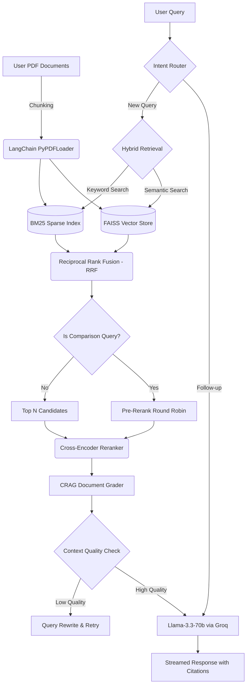

# Corrective Hybrid Search RAG Assistant

## Project Overview
The Corrective Hybrid RAG (Retrieval-Augmented Generation) Assistant is a Streamlit-based application for searching, querying, and conversing over PDF documents.

It implements a hybrid retrieval pipeline (FAISS + BM25) fused with Reciprocal Rank Fusion (RRF), followed by a cross-encoder reranker and a document-grade-based corrective loop (CRAG). The pipeline includes an adaptive router for follow-up detection, a document grader that prunes low-quality chunks, and diversity filtering for multi-document comparison queries.

## Features
- **Multi-PDF Upload**: Upload multiple PDF documents simultaneously via the Streamlit UI.
- **Corrective RAG (CRAG)**: A document grader evaluates and filters retrieved chunks before generation.
- **Double Round-Robin Comparison**: Automatically detects comparison queries and ensures all uploaded PDFs have an equal, balanced representation in the prompt to prevent "lost in the middle" errors.
- **Conversational Memory & Intent Routing**: A small chat history window is kept to detect follow-ups that don't require retrieval.
- **Hybrid Search**: Combines Dense (FAISS) and Sparse (BM25) vector retrieval for superior accuracy.
- **Cross-Encoder Reranking**: Re-evaluates search results for precise, context-aware answers.
- **Source Citations**: Transparently displays exactly which document and page the AI used to formulate its response.
- **Retrieval Inspector**: A robust debug dashboard to view exact retrieved chunks, cross-encoder scores, routing paths, and CRAG grading results.

## Architecture
The application follows the hybrid Corrective RAG pipeline (high level):



## Tech Stack
- **Frontend**: Streamlit
- **LLM Engine**: Groq API via `langchain-groq` (requires `GROQ_API_KEY` in `.env`)
- **Embeddings**: HuggingFace / `sentence-transformers` (configurable via `config.py`)
- **Reranker**: Cross-encoder (`cross-encoder/ms-marco-MiniLM-L-6-v2` by default)
- **Vector Database**: FAISS (local on-disk index at `faiss_index/`)
- **Keyword Search**: `rank_bm25` (local BM25 candidate generation)
- **Document Framework**: LangChain document loaders and the RecursiveCharacterTextSplitter

## Installation

1. Clone the repository and create/activate a Python virtual environment:

```bash
python -m venv venv
venv\Scripts\activate  # Windows
```

2. Install dependencies:

```bash
pip install -r requirements.txt
```

3. Configure environment variables (required):

Create a `.env` file in the project root and at minimum set your Groq API key:

```env
GROQ_API_KEY=your_groq_api_key_here
```

Notes:
- The LLM is provided via Groq (fast cloud inference). If you want to swap to another provider, update `rag/llm.py` and `config.py` accordingly.
- FAISS indices persist to the `faiss_index/` folder (see `config.FAISS_INDEX_PATH`). Uploading PDFs in the app builds/saves the index.

## How to Run

1. Start the Streamlit UI:

```bash
streamlit run app.py
```

2. Open the URL shown by Streamlit (normally `http://localhost:8501`).

3. Upload one or more PDFs via the uploader — this builds a FAISS index under `faiss_index/` and a BM25 index in-memory.

4. Ask questions in the chat. The app will prefer RAG context when confidence is above the threshold configured in `config.py` and fall back to the LLM otherwise.


## Evaluation
- An evaluation harness lives in `eval/`:
   - `eval/run_harness.py` — run a question-answer harness against a dataset (builds answers using the same retrieval+generation pipeline). See header comments for usage (it expects `faiss_index/` to exist).
   - `eval/run_ragas.py` — runs RAGAS scoring on `eval/harness_results.json` to report faithfulness, relevancy, precision and recall.

Example commands:

```bash
python eval/run_harness.py --dataset eval/eval_dataset.json --out eval/harness_results.json
python eval/run_ragas.py --results eval/harness_results.json
```

The eval harness writes `eval/harness_results.json`. `run_ragas.py` prints bucketed RAGAS scores and a routing accuracy summary for unanswerable items.

## Where to change behavior
- See `config.py` for model names, chunking, and retrieval thresholds.
- `rag/vector_store.py`, `rag/bm25.py`, and `rag/retriever.py` contain the retrieval logic.

## Author
**Moumita Paul**
*IIIT Lucknow*
